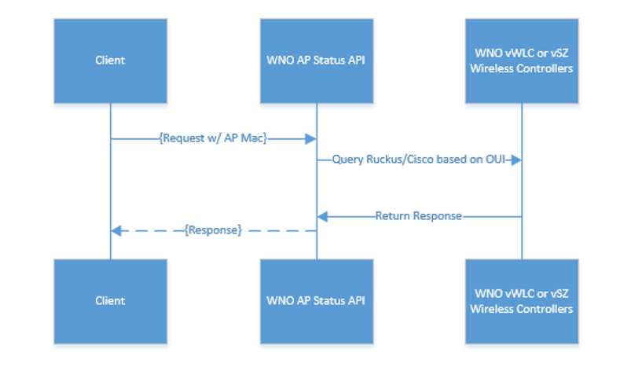
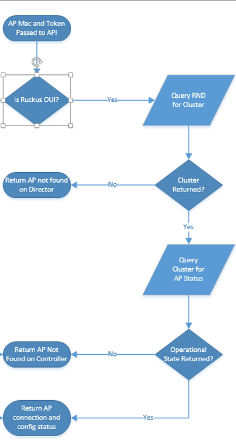
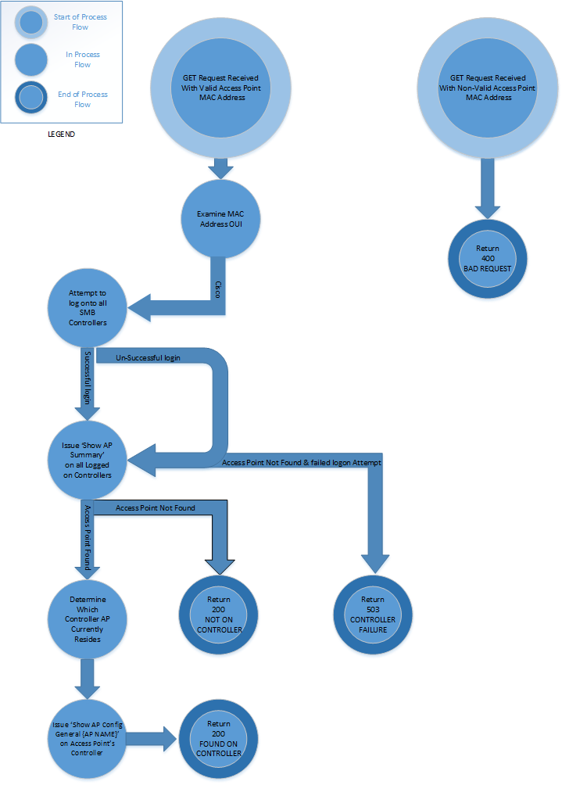
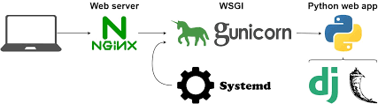

#FindAPStatus_API

#### Summary:

The FindAPStatus_API API will return the status of a given Access Point (AP) mac on any Wi-Fi controller by querying the various Wi-Fi controller systems where the AP would connect.  

It queries various systems in real-time and will return a response detailing information regarding the AP’s operational status.  It will give in-depth details about a AP’s connection status, configuration status (readiness to transmit), and also return other various status codes in the event of a failure.  The API is vendor-agnostic, so it will return a normalized payload for both Ruckus and Cisco APs, and will also be updated as new AP vendors are deployed by WNO.

#### Sequence Flow:

#### Target Audience:

The API is intended to support any Charter development requiring real-time status of Charter APs.

#### End-Point URLS:

##### Access Point Status API Endpoint
https://PATH/accessPointStatus
##### Swagger documentation:
https://PATH/ui

#### API Flow:

##### Ruckus:

##### Cisco:

#### Access Point Controller Join Chronology:

1. Cable Modem (‘CM’) with ISIW tag joins CMTS
	
2. AP connects to CM and gets ISIW space IP from DHCP.  

3. Depending on AP vendor, AP retrieves vendor-specific option 43 from DHCP

	- Ruckus:
    1. AP is directed to Ruckus Network Director (RND)
	2. RND examines subnet-based ruleset and directs AP to a regional controller
	3. AP Joins Controller and Zone specified by the Subnet Rule.  AP goes from ‘connectionState’ ‘Discovery’ to connectionState ‘Connect’
	4. Controller pushes firmware and configuration to the AP.  Several different configState values are returned during this process.
	5. AP configState changes to ‘completed’ and connectionState ‘connect’ to signal it is transmitting
	
	- Cisco:
	1. AP joins east or west provisioning controllers
	2. AP connection state changes to ‘Connect’
	3. AP configuration state changes to ‘DOWNLOADING’ while downloading firmware and configuration
	4. AP configState changes to ‘REGISTERED’ when transmitting if connectionState is ‘Connect’

#### Header Requirements

        {'Authorization':'bearer JWT token','mac':[APMAC]}

#### API Responses:

1. 'BAD_MAC_FORMAT'  -  HTTPStatus.BAD_REQUEST #400
This error is returned when the AP Mac is not passed to the API in the proper regex format.

2. 'NOT_IN_DIRECTOR' - HTTPStatus.OK #200
This status text currently applies only to Ruckus APs.  It means that the AP has not yet reached the Ruckus Network Director for its controller assignment

3.	'DIRECTOR_FAILURE' - HTTPStatus.SERVICE_UNAVAILABLE #503
This code is returned in the event that there is a system error querying the Ruckus Network Directors.
4.	'CONTROLLER_UNAUTHORIZED' - HTTPStatus.UNAUTHORIZED #401
Returned when the API is unable to authenticate directly to a WNO controller.  The authorizations are stored within a secured location in the API.  If this status is returned, please contact WAA.

5.	'DIRECTOR_UNAUTHORIZED' - HTTPStatus.UNAUTHORIZED #401
Returned when authorization fails to a Ruckus Network director.  Please contact WAA if this error is encountered.

6.	'CONTROLLER_FAILURE' - HTTPStatus.SERVICE_UNAVAILABLE #503
This error occurs when 1) the AP mac is not found on a controller, and 2) one of the controllers cannot be contacted.  This can happen because of system failure, system maintenance, etc.

7.	'NOT_ON_CONTROLLER' - HTTPStatus.OK #200
Returned if the AP is not found on a controller.

8.	'FOUND_ON_CONTROLLER' - HTTPStatus.OK #200
This status text is returned when the AP mac is found on one of the WNO controllers.  The response payload (detailed below) should be examined for further information regarding the AP’s readiness.

9.	'SYSTEM_EXCEPTION' - HTTPStatus.SERVICE_UNAVAILABLE #503
Returned when there is an exception in the API.  

10.	'NO_DIRECTOR_SESSIONS' - HTTPStatus.SERVICE_UNAVAILABLE #503
Returned when no Ruckus Network Director sessions are available.

#### API Return Payload:

        {
        "mac":"aA:bB:cC:dD:Ee:Ff",
        "model":"ZF7762-AC",
        "name":"AP_NAME",
        "ip":"x.x.x.x",
        "configState":"completed",
        "connectionState":"Connect",
        "vendor":"’Ruckus’"
        }

1.	'mac': same as the input passed
2.	‘vendor’: the AP’s manufacturer, currently ‘Ruckus’ or ‘Cisco’
3.	'model': the AP’s model as reported by the controller
4.	‘name’: the AP’s name on the controller
5.	‘ip’: the IP address of the AP as reported by the controller
6.	'connectionState': details whether the AP is in one of the following statuses:  ‘Discovery’, ‘Connect’, or ‘Disconnect’.  ‘Disconnect’ implies that the AP is not currently attached to a controller.  Note that Discovery connectionState applies to Ruckus controllers and is normally returned when the AP first joins to the controller.  
7.	‘configState’
    
    -	Ruckus:

            "configState" : {
            "description" : "State of the AP configuration.",
            "enum" : [ "newConfig", "fwApplied", "fwDownloaded", "fwFailed", "configApplied", "completed", "configFailed" ]

    -	Cisco:

            ‘DOWNLOADING’ or ‘REGISTERED’
-	configState of ‘completed’ or ‘REGISTERED’ indicates that the AP is fully operational if the connectionState is ‘Connect’

#### API Access

Access is granted by Wifi Analytics and Automation for a specific application.  A request should be sent to.  Authorization tokens should be protected and not shared between individuals or other departments.

#### System Information

##### Framework:
The API Framework was developed and is maintained via the following Python Modules
1. Flask: https://flask.palletsprojects.com/en/1.1.x/
2. FlaskRestX: https://flask-restx.readthedocs.io/en/latest/

##### WSGI:
WSGI as a standard interface that modules and containers implement. WSGI is now the accepted approach for running Python web applications.
More Information about WSGI can be found at https://www.python.org/dev/peps/pep-3333/

The Web Server Gateway Interface (WSGI) is served via Gunicorn (below)

Gunicorn 'Green Unicorn' is a Python WSGI HTTP Server for UNIX. It's a pre-fork worker model. The Gunicorn server is broadly compatible with various web frameworks, simply implemented, light on server resources, and fairly speedy.  
https://gunicorn.org/#docs

##### Proxy Server:
NGINX is open source software for web serving, reverse proxying, caching, load balancing, media streaming, and more. It started out as a web server designed for maximum performance and stability.  
https://nginx.org/en/docs/

#### System Set up

##### File Structuring 
        .
        ├── apiLog.log
        ├── CiscoFunctions
        │   ├── CiscoWlcFunctions.py
        │   └── ControllersAndMarkets.json
        ├── images
        │   ├── apiFlow.png
        │   ├── ciscoApiFlow.png
        │   ├── flow.png
        │   └── images_Charter_R_Logo_RGB.png
        ├── LoggingFunctions
        │   ├── apiLogger.py
        │   ├── __init__.py
        │   └── logging.ini
        ├── pyvenv.cfg
        ├── README.md
        ├── Requirements.txt
        ├── RuckusFunctions
        │   ├── ruckusAPStatus.py
        │   ├── sdkRND_API.py
        │   └── sdkSCG.py
        ├── run.py
        ├── selfInstall
        │   ├── api
        │   │   ├── apStatus
        │   │   │   ├── apFunctions.py
        │   │   │   ├── apParser.py
        │   │   │   ├── endpoints.py
        │   │   │   └── ruckusOui.py
        │   │   ├── auth
        │   │   │   ├── authParser.py
        │   │   │   └── decorators.py
        │   │   ├── exceptions.py
        │   │   └── __init__.py
        │   ├── config.py
        │   ├── __init__.py
        │   ├── models
        │   │   └── users.py
        ├── selfInstallApi.sock
        └── WNO_AP_Status_Document.docx

##### Linux Service

        [Unit]  
        Description=Service to Start gunicorn workers for NGINX  
        After=network.target

        [Service]  
        User=changeme   
        Group=changeme  
        WorkingDirectory=/path/to/repo/FindAPStatus_API/
        Environment="PATH=/path/to/repo/FindAPStatus_API/bin/"
        EnvironmentFile=/path/to/repo/FindAPStatus_API/.env
        ExecStart=/path/to/repo/FindAPStatus_API/bin/gunicorn --workers 3 --timeout 75 --bind /path/to/unix:selfInstallApi.sock -m 007 run:app

        [Install]
        WantedBy=multi-user.target

##### Nginx Configuration 

Nginx config:

        # For more information on configuration, see:
        #   * Official English Documentation: http://nginx.org/en/docs/
        #   * Official Russian Documentation: http://nginx.org/ru/docs/

        user nginx;
        worker_processes auto;
        error_log /var/log/nginx/error.log;
        pid /run/nginx.pid;

        # Load dynamic modules. See /usr/share/doc/nginx/README.dynamic.
        include /usr/share/nginx/modules/*.conf;

        events {
                worker_connections 1024;
        }

        http {
        log_format  main  '$remote_addr - $remote_user [$time_local] "$request" '
                      '$status $body_bytes_sent "$http_referer" '
                      '"$http_user_agent" "$http_x_forwarded_for"';

        access_log  /var/log/nginx/access.log  main;

                sendfile            on;
                tcp_nopush          on;
                tcp_nodelay         on;
                keepalive_timeout   65;
                types_hash_max_size 2048;

        include             /etc/nginx/mime.types;
        default_type        application/octet-stream;

            # Load modular configuration files from the /etc/nginx/conf.d directory.
            # See http://nginx.org/en/docs/ngx_core_module.html#include
            # for more information.
    include /etc/nginx/conf.d/*.conf;
    include /etc/nginx/sites-enabled/*.conf;

Nginx sites-available config:

        server {
                listen 443 ssl;
                server_name [DNS NAME HERE];
                ssl_certificate path/to/.crt;
                ssl_certificate_key /path/to/.key;
                underscores_in_headers on;
                location / {

                    proxy_set_header Authorization $http_authorization;
                    proxy_set_header X-Forwarded-User $remote_user;
                    proxy_set_header Host $http_host;
                    proxy_set_header X-Forwarded-Proto $scheme;
                    proxy_pass http://unix:/path/to/self_install_api/selfInstallApi.sock;

                proxy_connect_timeout 600;
                proxy_send_timeout 600;
                proxy_read_timeout 600;
                send_timeout 600;

            }
        }

